# MADAPORC - User flows

Parcours utilisateur de chaque module, sous forme de diagrammes de flux.
Les schemas sont ecrits en **Mermaid** : ils s'affichent automatiquement sur
GitHub/GitLab, et dans VSCode avec l'extension *Markdown Preview Mermaid Support*.

Base : http://localhost:8082 - Connexion requise (compte Administrateur).

## Legende

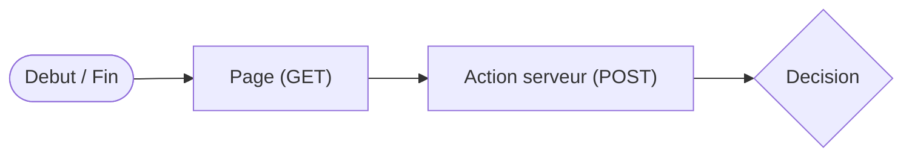
```mermaid
flowchart LR
    A([Debut / Fin]) --> B["Page (GET)"]
    B --> C["Action serveur (POST)"]
    C --> D{"Decision"}
```

- Rond = point d'entree ou de sortie du parcours
- Rectangle = une page (route GET) ou une action (route POST)
- Losange = une condition (le flux se separe selon la reponse)
- Le texte entre `[ ]` rappelle la route reelle du controleur

---

## 0. Connexion et navigation generale

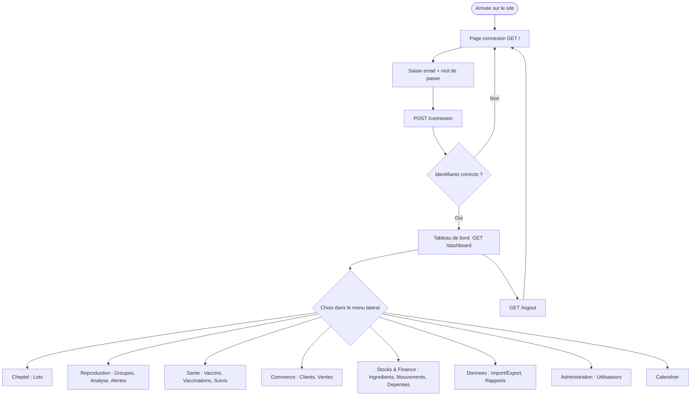
```mermaid
flowchart TD
    Start([Arrivee sur le site]) --> Login["Page connexion  GET /"]
    Login --> Saisie["Saisie email + mot de passe"]
    Saisie --> Post["POST /connexion"]
    Post --> Check{"Identifiants corrects ?"}
    Check -->|Non| Login
    Check -->|Oui| Dash["Tableau de bord  GET /dashboard"]
    Dash --> Menu{"Choix dans le menu lateral"}
    Menu --> Cheptel["Cheptel : Lots"]
    Menu --> Repro["Reproduction : Groupes, Analyse, Alertes"]
    Menu --> Sante["Sante : Vaccins, Vaccinations, Suivis"]
    Menu --> Commerce["Commerce : Clients, Ventes"]
    Menu --> Stocks["Stocks & Finance : Ingredients, Mouvements, Depenses"]
    Menu --> Donnees["Donnees : Import/Export, Rapports"]
    Menu --> Admin["Administration : Utilisateurs"]
    Menu --> Cal["Calendrier"]
    Dash --> Logout["GET /logout"]
    Logout --> Login
```

---

## 1. Lots de porcs (Cheptel)

Brique de base : la plupart des autres modules s'appuient sur un lot.

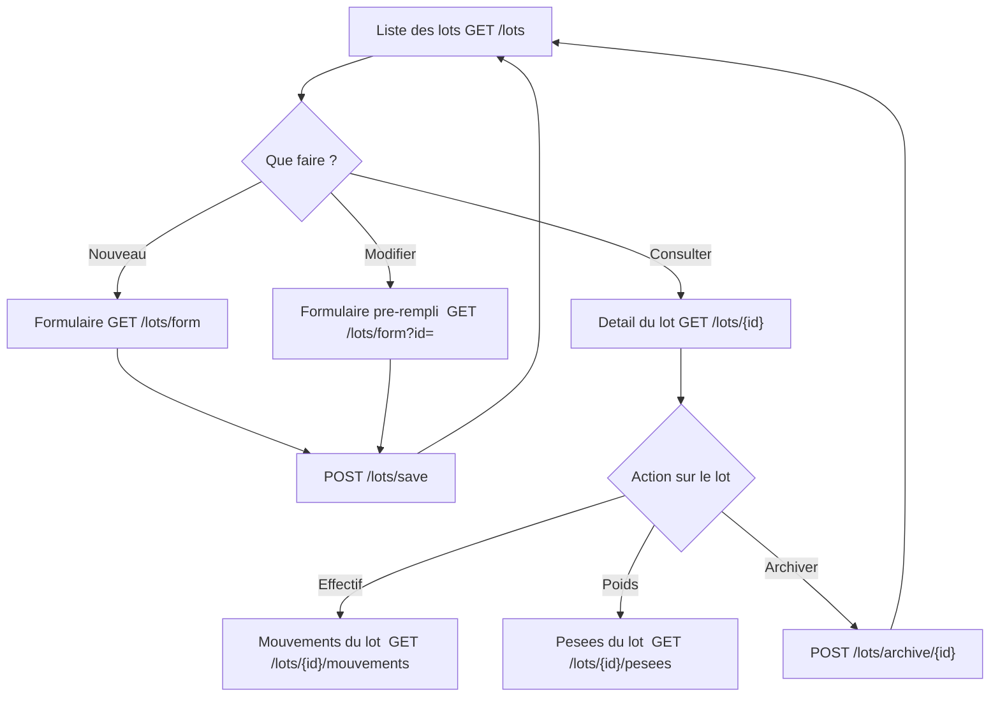
```mermaid
flowchart TD
    Liste["Liste des lots  GET /lots"] --> Choix{"Que faire ?"}
    Choix -->|Nouveau| Form["Formulaire  GET /lots/form"]
    Choix -->|Modifier| FormEdit["Formulaire pre-rempli  GET /lots/form?id="]
    Choix -->|Consulter| Detail["Detail du lot  GET /lots/{id}"]
    Form --> Save["POST /lots/save"]
    FormEdit --> Save
    Save --> Liste
    Detail --> Actions{"Action sur le lot"}
    Actions -->|Effectif| Mouv["Mouvements du lot  GET /lots/{id}/mouvements"]
    Actions -->|Poids| Pesee["Pesees du lot  GET /lots/{id}/pesees"]
    Actions -->|Archiver| Arch["POST /lots/archive/{id}"]
    Arch --> Liste
```

### 1a. Mouvement d'effectif d'un lot

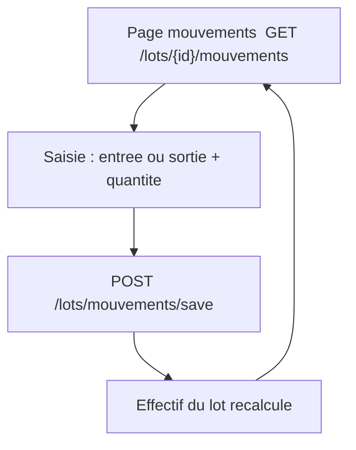
```mermaid
flowchart TD
    M["Page mouvements  GET /lots/{id}/mouvements"] --> Saisie["Saisie : entree ou sortie + quantite"]
    Saisie --> Save["POST /lots/mouvements/save"]
    Save --> Recalcul["Effectif du lot recalcule"]
    Recalcul --> M
```

### 1b. Pesee d'un lot

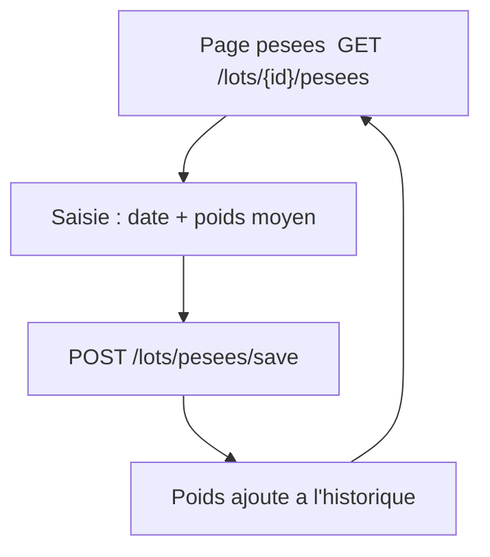
```mermaid
flowchart TD
    P["Page pesees  GET /lots/{id}/pesees"] --> Saisie["Saisie : date + poids moyen"]
    Saisie --> Save["POST /lots/pesees/save"]
    Save --> Hist["Poids ajoute a l'historique"]
    Hist --> P
```

---

## 2. Groupes de reproduction

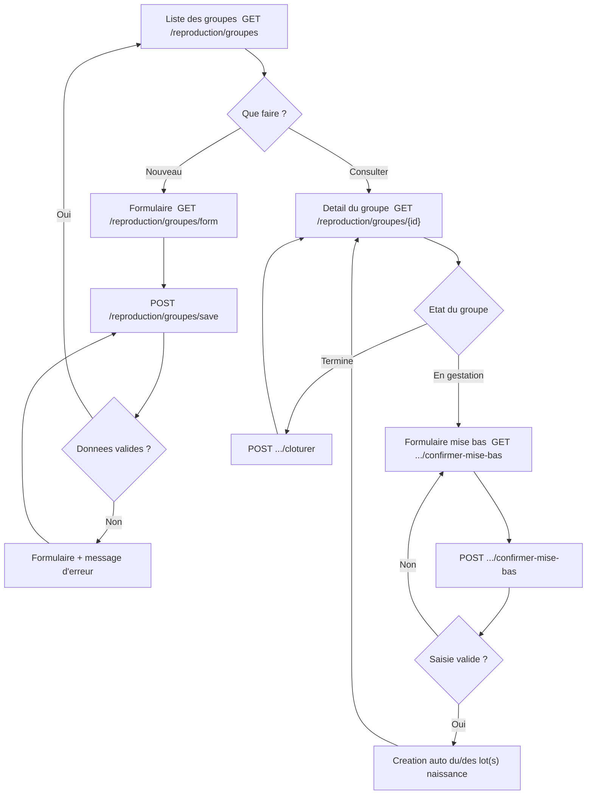
```mermaid
flowchart TD
    Liste["Liste des groupes  GET /reproduction/groupes"] --> Choix{"Que faire ?"}
    Choix -->|Nouveau| Form["Formulaire  GET /reproduction/groupes/form"]
    Choix -->|Consulter| Detail["Detail du groupe  GET /reproduction/groupes/{id}"]
    Form --> Save["POST /reproduction/groupes/save"]
    Save --> Valide{"Donnees valides ?"}
    Valide -->|Non| FormErr["Formulaire + message d'erreur"]
    FormErr --> Save
    Valide -->|Oui| Liste
    Detail --> Etat{"Etat du groupe"}
    Etat -->|En gestation| ConfForm["Formulaire mise bas  GET .../confirmer-mise-bas"]
    Etat -->|Termine| Clot["POST .../cloturer"]
    ConfForm --> ConfPost["POST .../confirmer-mise-bas"]
    ConfPost --> Ok{"Saisie valide ?"}
    Ok -->|Non| ConfForm
    Ok -->|Oui| Lots["Creation auto du/des lot(s) naissance"]
    Lots --> Detail
    Clot --> Detail
```

---

## 3. Analyse reproductive

Different du groupe : ici on calcule des taux (aptitude, fertilite) par lot femelle.

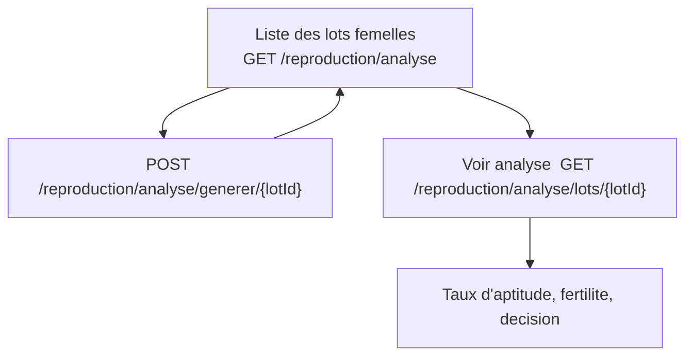
```mermaid
flowchart TD
    Liste["Liste des lots femelles  GET /reproduction/analyse"] --> Gen["POST /reproduction/analyse/generer/{lotId}"]
    Gen --> Liste
    Liste --> Voir["Voir analyse  GET /reproduction/analyse/lots/{lotId}"]
    Voir --> Detail["Taux d'aptitude, fertilite, decision"]
```

---

## 4. Alertes de reproduction

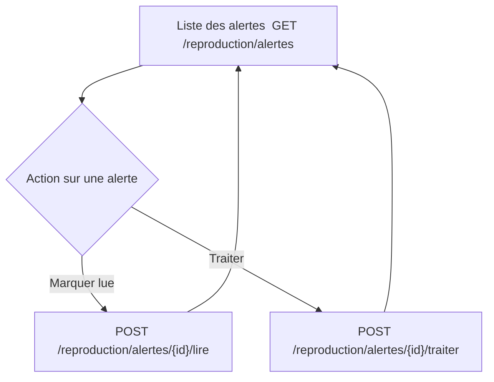
```mermaid
flowchart TD
    Liste["Liste des alertes  GET /reproduction/alertes"] --> Choix{"Action sur une alerte"}
    Choix -->|Marquer lue| Lire["POST /reproduction/alertes/{id}/lire"]
    Choix -->|Traiter| Trait["POST /reproduction/alertes/{id}/traiter"]
    Lire --> Liste
    Trait --> Liste
```

---

## 5. Sante

### 5a. Vaccins

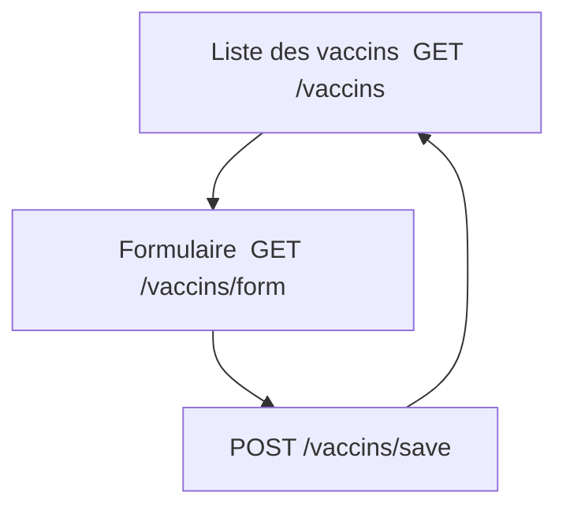
```mermaid
flowchart TD
    Liste["Liste des vaccins  GET /vaccins"] --> Form["Formulaire  GET /vaccins/form"]
    Form --> Save["POST /vaccins/save"]
    Save --> Liste
```

### 5b. Vaccinations

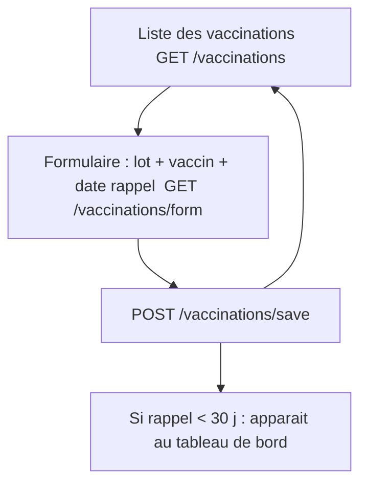
```mermaid
flowchart TD
    Liste["Liste des vaccinations  GET /vaccinations"] --> Form["Formulaire : lot + vaccin + date rappel  GET /vaccinations/form"]
    Form --> Save["POST /vaccinations/save"]
    Save --> Liste
    Save --> Dash["Si rappel < 30 j : apparait au tableau de bord"]
```

### 5c. Suivis sanitaires

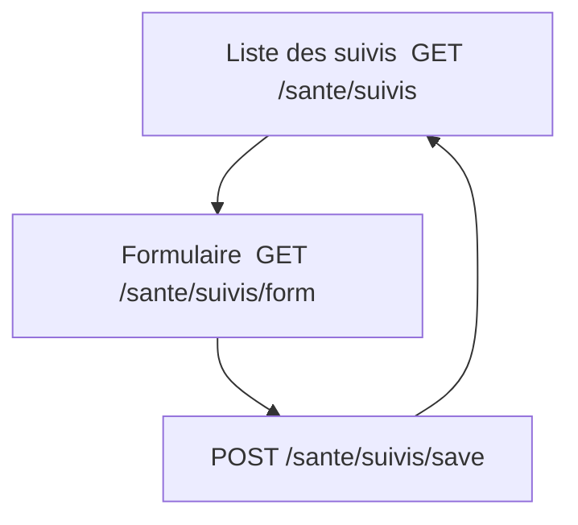
```mermaid
flowchart TD
    Liste["Liste des suivis  GET /sante/suivis"] --> Form["Formulaire  GET /sante/suivis/form"]
    Form --> Save["POST /sante/suivis/save"]
    Save --> Liste
```

---

## 6. Clients

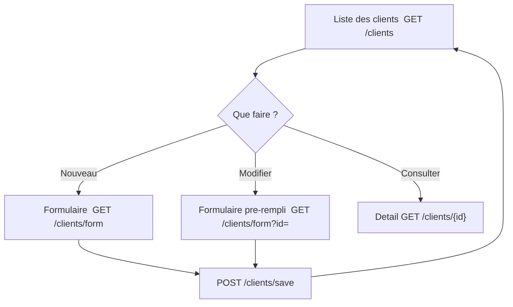
```mermaid
flowchart TD
    Liste["Liste des clients  GET /clients"] --> Choix{"Que faire ?"}
    Choix -->|Nouveau| Form["Formulaire  GET /clients/form"]
    Choix -->|Modifier| FormEdit["Formulaire pre-rempli  GET /clients/form?id="]
    Choix -->|Consulter| Detail["Detail  GET /clients/{id}"]
    Form --> Save["POST /clients/save"]
    FormEdit --> Save
    Save --> Liste
```

---

## 7. Ventes

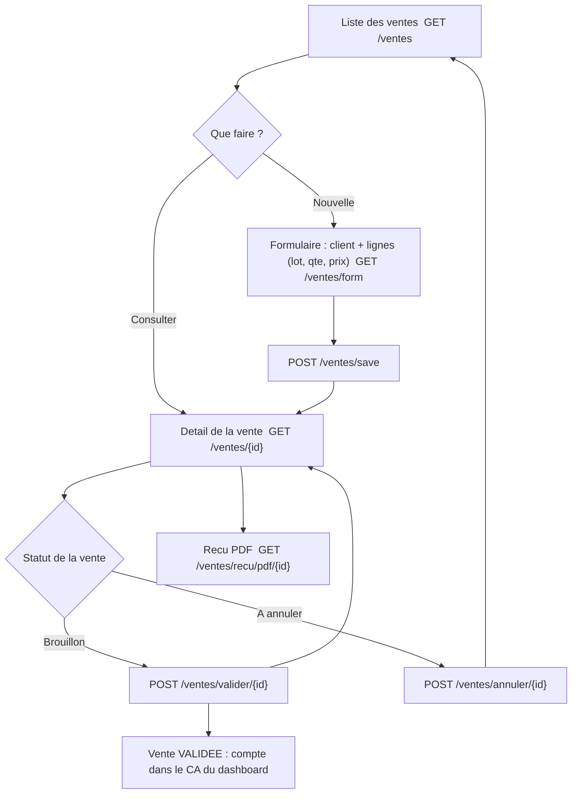
```mermaid
flowchart TD
    Liste["Liste des ventes  GET /ventes"] --> Choix{"Que faire ?"}
    Choix -->|Nouvelle| Form["Formulaire : client + lignes (lot, qte, prix)  GET /ventes/form"]
    Choix -->|Consulter| Detail["Detail de la vente  GET /ventes/{id}"]
    Form --> Save["POST /ventes/save"]
    Save --> Detail
    Detail --> Statut{"Statut de la vente"}
    Statut -->|Brouillon| Valider["POST /ventes/valider/{id}"]
    Statut -->|A annuler| Annuler["POST /ventes/annuler/{id}"]
    Valider --> Detail
    Valider --> Dash["Vente VALIDEE : compte dans le CA du dashboard"]
    Annuler --> Liste
    Detail --> Pdf["Recu PDF  GET /ventes/recu/pdf/{id}"]
```

---

## 8. Stocks et finance

### 8a. Ingredients

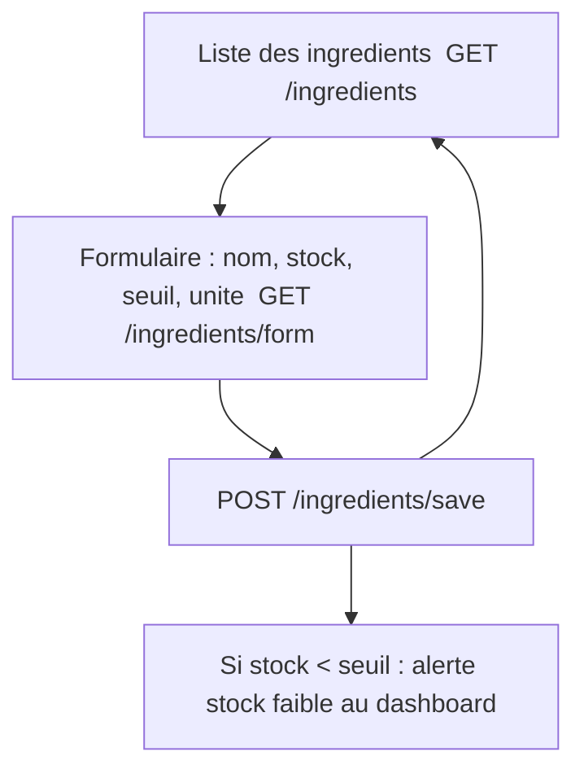
```mermaid
flowchart TD
    Liste["Liste des ingredients  GET /ingredients"] --> Form["Formulaire : nom, stock, seuil, unite  GET /ingredients/form"]
    Form --> Save["POST /ingredients/save"]
    Save --> Liste
    Save --> Alerte["Si stock < seuil : alerte stock faible au dashboard"]
```

### 8b. Mouvements de stock

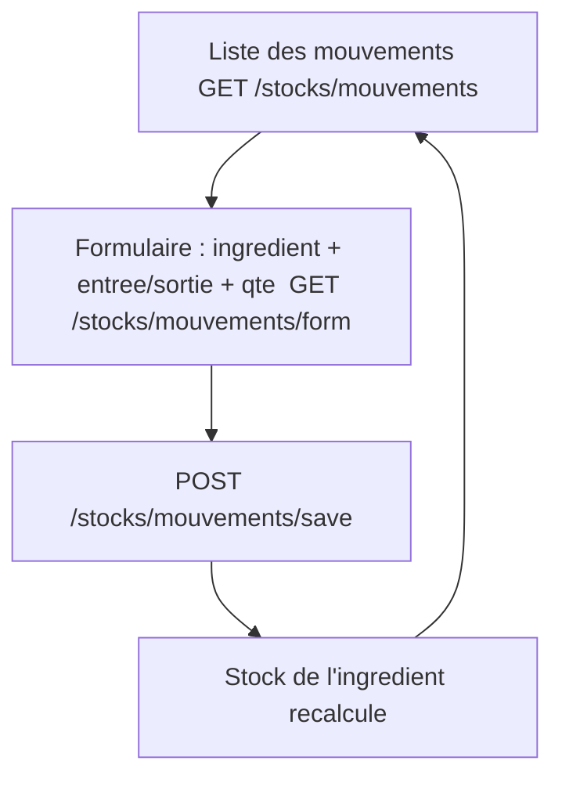
```mermaid
flowchart TD
    Liste["Liste des mouvements  GET /stocks/mouvements"] --> Form["Formulaire : ingredient + entree/sortie + qte  GET /stocks/mouvements/form"]
    Form --> Save["POST /stocks/mouvements/save"]
    Save --> Maj["Stock de l'ingredient recalcule"]
    Maj --> Liste
```

### 8c. Depenses

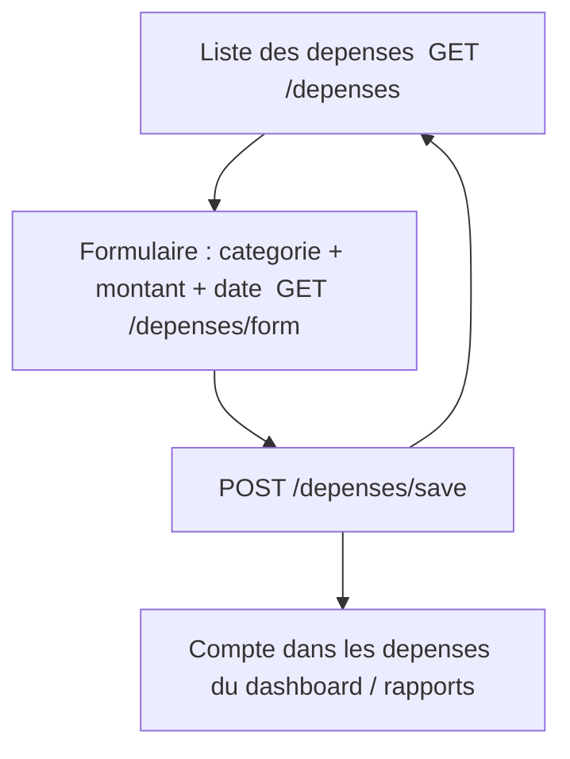
```mermaid
flowchart TD
    Liste["Liste des depenses  GET /depenses"] --> Form["Formulaire : categorie + montant + date  GET /depenses/form"]
    Form --> Save["POST /depenses/save"]
    Save --> Liste
    Save --> Dash["Compte dans les depenses du dashboard / rapports"]
```

---

## 9. Donnees

### 9a. Import / Export

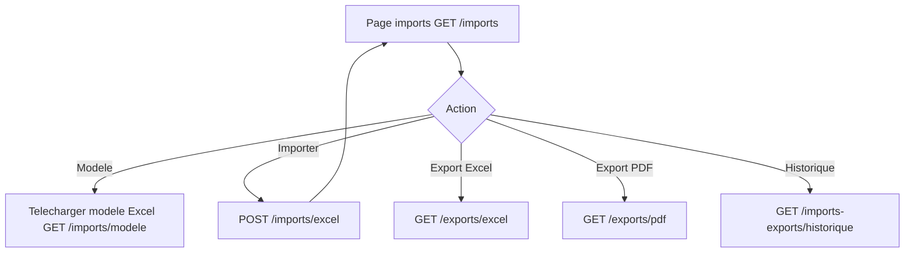
```mermaid
flowchart TD
    Page["Page imports  GET /imports"] --> Choix{"Action"}
    Choix -->|Modele| Mod["Telecharger modele Excel  GET /imports/modele"]
    Choix -->|Importer| Imp["POST /imports/excel"]
    Choix -->|Export Excel| ExcE["GET /exports/excel"]
    Choix -->|Export PDF| ExpP["GET /exports/pdf"]
    Choix -->|Historique| Hist["GET /imports-exports/historique"]
    Imp --> Page
```

### 9b. Rapports

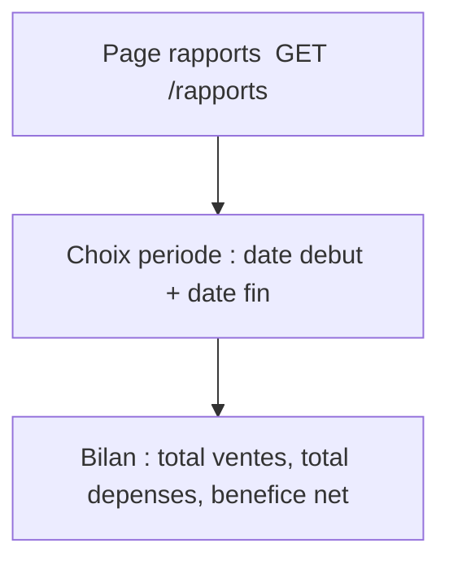
```mermaid
flowchart TD
    Page["Page rapports  GET /rapports"] --> Periode["Choix periode : date debut + date fin"]
    Periode --> Bilan["Bilan : total ventes, total depenses, benefice net"]
```

---

## 10. Calendrier

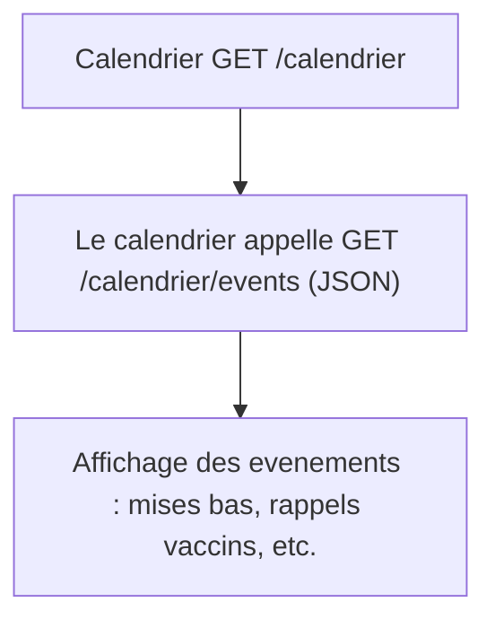
```mermaid
flowchart TD
    Page["Calendrier  GET /calendrier"] --> Fetch["Le calendrier appelle GET /calendrier/events (JSON)"]
    Fetch --> Affiche["Affichage des evenements : mises bas, rappels vaccins, etc."]
```

---

## 11. Administration - Utilisateurs

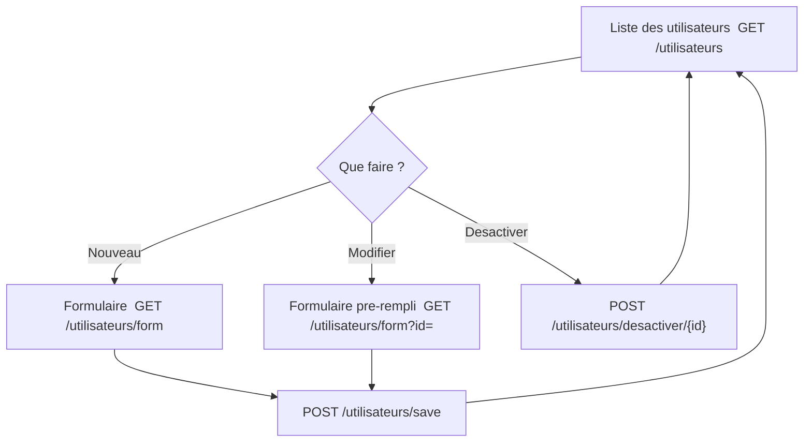
```mermaid
flowchart TD
    Liste["Liste des utilisateurs  GET /utilisateurs"] --> Choix{"Que faire ?"}
    Choix -->|Nouveau| Form["Formulaire  GET /utilisateurs/form"]
    Choix -->|Modifier| FormEdit["Formulaire pre-rempli  GET /utilisateurs/form?id="]
    Choix -->|Desactiver| Des["POST /utilisateurs/desactiver/{id}"]
    Form --> Save["POST /utilisateurs/save"]
    FormEdit --> Save
    Save --> Liste
    Des --> Liste
```
